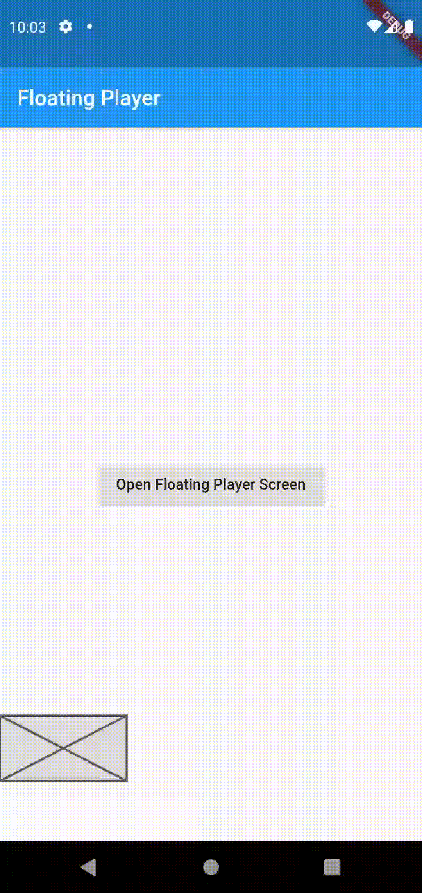
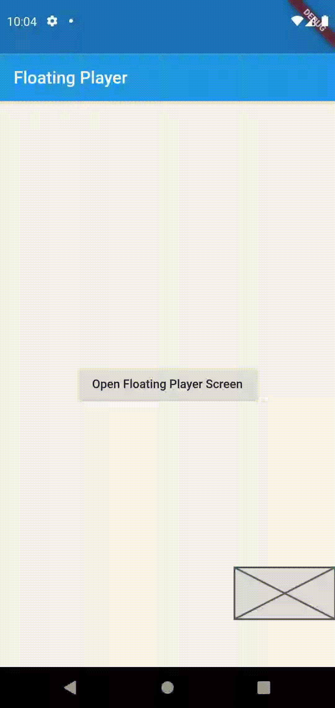

# Flutter Floating PLayer

<table><tr>
  <td style="text-align: center">
    
</td>
<td style="text-align: center">
    
</td>
  <td style="text-align: center">
    
</td>
  <td style="text-align: center">
    
</td>
</tr></table>

*This widget still Under Development to fully support Flutter VLC Player (iOS/Android)

Special thanks to [Draggable Widget](https://github.com/adar2378/draggable_widget)
